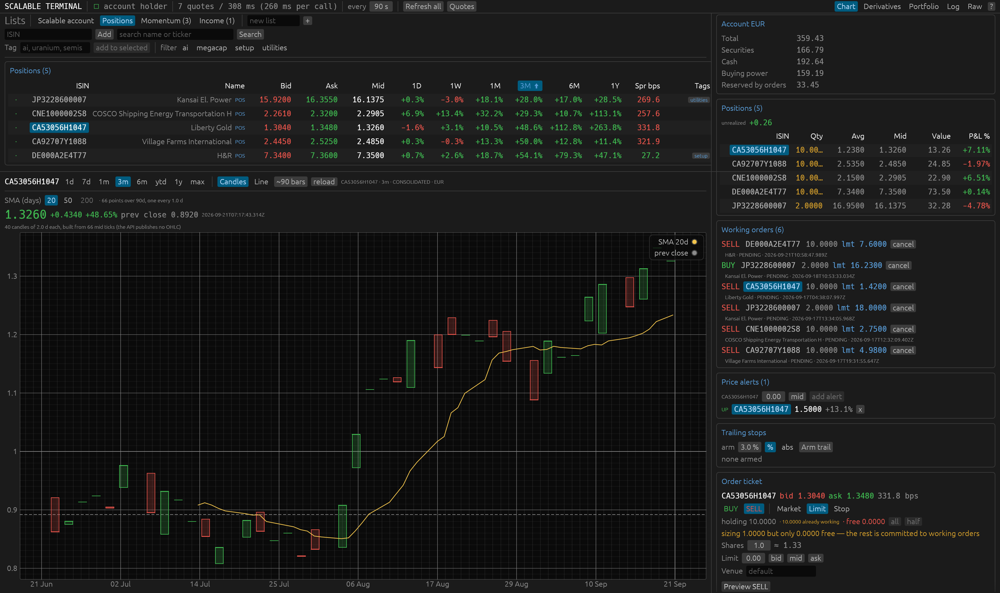
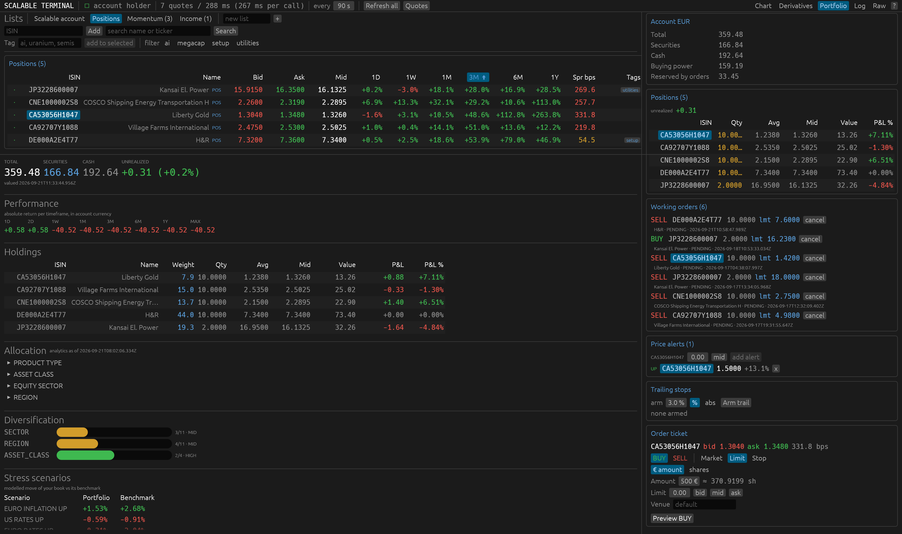
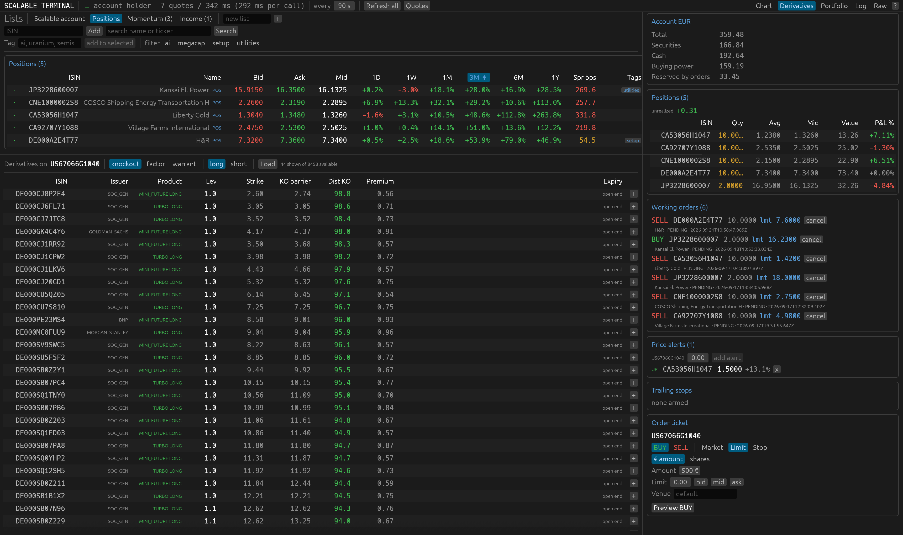

# Scalable Terminal

A native desktop trading terminal for the Scalable Capital broker, in the spirit of Interactive Brokers' Trader Workstation.

Status: alpha.



The portfolio view, with allocation, diversification scores and stress scenarios.



The derivatives view, listing what is tradable on whichever instrument you last clicked.



## Why

The Scalable Capital apps are built for buying an ETF once a month. They do not show a bid and an ask at the same time, what the spread is costing you, cost basis next to a live price, or what is resting on the market next to the position it would close.

This puts all of it on one screen. It will never be Trader Workstation, because the data behind it is thinner, but everything Scalable does expose is here rather than three taps away.

## Backend

Scalable Capital has no public REST API for retail brokerage accounts. Since August 2026 it has an official agent interface, Agentic Investing, shipped as a command line tool called `sc` and as a hosted MCP server.

`sc` is this terminal's entire backend. No scraping, no browser automation, no private endpoints.

* The app has no HTTP client. It spawns `sc` as a child process with `--json` and parses stdout.
* `sc` owns the session. `sc login` runs an OAuth device code flow. The app never sees credentials.
* Responses are enveloped as `{"ok": bool, "command": string, "data": ...}`. Logical failures arrive with `ok: false` and exit code zero, so success is read from the envelope rather than the exit status.
* Read payloads nest under `data.result`. `broker chart` is the exception and puts them directly in `data`. The unwrapper handles both.
* All calls run on a background thread. The UI thread never blocks on a subprocess.
* Requests are signed by the Secure Enclave, so everything fails with `device_locked` while the Mac is locked. That arrives with the same exit code as a genuine auth failure, so it is classified separately rather than sending you to log in again for no reason.

Commands used: `whoami`, `broker overview`, `broker cash-breakdown`, `broker holdings`, `broker transactions`, `broker analytics`, `broker watchlist`, `broker quote`, `broker chart`, `broker search`, `broker derivatives search`, `broker trade buy`, `broker trade sell`, `broker trade cancel`.

Two CLI details shaped the design:

* There is no command to list orders, and the account overview carries no order list. Resting orders come from `broker transactions` filtered to status PENDING.
* Orders are two phase. Phase one returns a confirmation id and a full pre trade cost disclosure; phase two repeats the order with that id. The CLI publishes this as a contract requiring the disclosure be shown to a human in between. The confirm dialog is that contract as a screen.

## Rate limits

Undocumented, so measured. Quotes are tolerant. Charts and derivative searches are not.

Quote polling, 17 September 2026:

```
1 instrument                160 to 230 ms
9 instruments sequential          2077 ms
9 instruments, 8 in parallel       491 ms
27 instruments, 8 in parallel      882 ms
27 instruments, 12 in parallel     769 ms
```

Roughly 33 ms per instrument once requests overlap, so about 50 instruments per round of a second and a half. Past 8 parallel workers the gain is small: process spawn dominates, not the network. Nothing was refused at any width tried.

Charts are the opposite. Eight in quick succession were all refused:

```
RATE_LIMITED: backend rate limit exceeded during BrokerChart
```

Cleared after 46 seconds. Derivative searches and the watchlist endpoint refuse the same way.

Handling:

* A refusal is treated as account wide. Tripping a second endpoint after the first only makes it worse.
* All polling pauses for 90 seconds, with a countdown in the top bar that ticks on its own, since nothing completes during a pause to trigger a redraw.
* Chart requests made during a pause are queued and issued when it ends.
* Charts are cached per instrument and timeframe, derivative searches per underlying, family and direction.

## Install

Enable Agentic Investing in the Scalable Capital web platform under Profile, Security, Agentic Investing. This is the switch that lets any external program reach the account.

```
brew tap ScalableCapital/tap
brew trust scalablecapital/tap
brew install scalable-cli
sc login
```

`sc login --local-read-only` blocks every write command until you log in again without the flag.

Worth confirming the CLI works before starting the terminal, since the terminal is only a front end:

```
sc whoami --json
sc broker overview --json
sc broker holdings --json
```

Then:

```
cargo run --release
```

## Stack

Rust for the binary. No runtime to install.

egui for the interface, through eframe and wgpu. Immediate mode suits a screen that is mostly dense tables changing several times a second: the table is a loop over current data, not a widget tree kept in sync. egui_plot draws the chart.

Plain threads and channels, no async runtime. The UI runs on the main thread, one background thread owns all input and output, and a short lived pool of eight threads fans out quote requests. The work is slow subprocess calls, not thousands of sockets, so an async runtime would add machinery for nothing.

Seven direct dependencies: eframe, egui, egui_extras, egui_plot, serde, serde_json, image. Around 186 crates once the graphics stack is counted.

## Screen

Top bar: session, last quote round time and instrument count, poll interval, refresh buttons, rate limit countdown, view tabs.

Watchlist strip: your Scalable watchlist plus every position you hold, marked POS. Adding and removing changes the account, so the terminal and your phone agree. Columns are bid, ask, mid, intraday change and spread in basis points, colour coded. A marker flags quotes the broker considers stale.

Positions appear in the strip because Scalable will not watchlist an instrument you own. The API accepts the request, answers `ok`, then reports `is_on_watchlist: false` and nothing appears. Tested across six instruments: held refused, unheld accepted. They have no remove button, since there is no watchlist entry to remove.

Right column: cash and buying power, positions with cost basis and unrealised profit against a live mid, working orders with cancel, trailing stops, order ticket.

Main area:

* Chart. Candles or line, previous close as a dashed baseline. Timeframes 1d, 7d, 1m, 3m, 6m, ytd, 1y, max. Moving averages at 20, 50 and 200 days.
* Derivatives. Knockouts, factor certificates and warrants on whatever instrument you last clicked, filtered by family and direction. Leverage, strike, knockout barrier, distance to barrier, premium, expiry. Clicking a row makes that derivative the active instrument.
* Portfolio. Totals, return per timeframe, holdings with weight and profit, allocation by product type, asset class, sector and region, diversification scores, stress scenarios against a benchmark.
* Log. Every `sc` invocation, timed.
* Raw. The unmodified JSON behind each endpoint.

## Orders

Market, limit and stop. Venue overridable. No bracket or OCO, because the CLI has neither.

Preview runs phase one. The dialog shows the whole disclosure: shares, estimated volume, bid, ask, mid, spread in basis points, venue and status, entry, ongoing and exit costs, suitability, warnings, and seconds remaining on the confirmation. Submit runs phase two, and is enabled only once CONFIRM is typed, the instrument is tradable, the confirmation is unexpired, and any unsuitability warning is accepted. It disarms itself when the countdown reaches zero rather than failing at the broker.

Selling sizes by shares, with all and half buttons computed from shares that are genuinely free. The broker reports `blocked_quantity` as zero even for a position entirely committed to a resting sell, so sizing from quantity minus blocked would offer shares already on the market. Resting sells are subtracted here instead.

`max_order_notional`, `allowed_isins` and `denied_isins` in the CLI's `config.toml` are enforced by the CLI, which is a better place for a hard limit than this app.

## Trailing stops

The CLI has no trailing order type and no amend command, so a trail cannot be handed to the broker. It is imitated: track the high water mark, and when the resting stop falls behind, cancel it and place a new one higher.

The app does the watching and the arithmetic, then asks before moving anything. Arm a trail on a position as a percentage or an absolute amount. When the stop should move, a button appears. Pressing it cancels the resting stop and previews the replacement through the usual confirm dialog.

Interesting detail: the broker's own order schema carries a `trailing_stop_info` field, so the backend models trailing stops natively. The CLI exposes no way to set one.

Constraints:

* There is an unprotected window. Shares are committed to the resting stop, so the old order must be cancelled before a replacement can be previewed. Between the cancel and the confirmation there is no stop, and the panel says so in red while that holds.
* It follows only while the app is running and the Mac is unlocked, in steps of the poll interval. Otherwise the stop stays where it was last placed.
* It will not chase small moves. A replacement costs three calls and opens that window, so a ratchet is offered only once the improvement is worth a tenth of a percent.

The high water mark persists to `~/.config/scalable-terminal/trails.json`, since it is the only part of a trail that cannot be recovered from the broker. The resting stop and share count are read back from live account state every refresh.

## Data limits

No streaming. No websocket or server sent events in the CLI, so prices are polled, one process per instrument, eight at a time. The round time is always on screen.

No market depth. Level one only.

No OHLC. The chart endpoint returns mid price ticks, so candles are built here by bucketing ticks into intervals. Open and close are the first and last tick in a bucket, high and low its extremes. Empty buckets are skipped rather than carried forward, so a gap stays a gap instead of becoming a flat bar that never traded.

The chart endpoint downsamples by span and never returns more than about 190 points:

```
timeframe   points   typical gap   span
1d             173        10 min     1.5 days
7d             186        30 min     7.5 days
1m             191         2 hours   31.5 days
3m              67         1 day     91.9 days
6m             130         1 day    183.9 days
ytd            182         1 day    257.9 days
1y             127         2 days   363.9 days
max            107        30 days   3212.9 days
```

Hence moving averages in calendar days rather than bars. A twenty bar average would be three hours on 1d and fifty years on max, and a two hundred bar window would not exist on any timeframe. In days, 20, 50 and 200 mean what they normally mean. A window longer than the loaded data is disabled rather than drawn short. All three are available on ytd, 1y and max; none on 1d, which is correct for a single session.

## Tests

```
cargo test
```

Thirty two tests, running the extractors against real payloads captured from a live account with identifiers removed, in `tests/fixtures`. The JSON shapes are undocumented and can change, so a renamed field fails a test instead of quietly blanking a panel.

They assert behaviour, not just field names. Securities plus cash reconcile to the reported total. Chart timestamps increase. Allocation weights sum to one. Candle aggregation satisfies the open, high, low, close relationships and accounts for every tick exactly once. A moving average matches a mean computed directly. An expired confirmation disarms submit. Free to sell quantity subtracts resting sells. `device_locked` is not classified as an auth failure. A watchlist refusal hidden inside an `ok` response is detected.

To refresh fixtures after a CLI upgrade, rerun each `sc broker <command> --json` into `tests/fixtures` and strip the account and portfolio identifiers.

## Screenshot mode

```
cargo run --release -- --screenshot out.png 8 --tab chart --select <isin>
```

Renders, waits the given seconds for data, writes a PNG, exits. `--tab` picks the view, `--select` the instrument. `--redact` replaces the account holder's name with a placeholder and works outside screenshot mode too. It hides the name only; balances, positions and orders stay visible.

This exists because the app cannot be brought to the foreground from a script on macOS, so an ordinary screen capture photographs whatever is in front instead.

## Code

* `src/sc.rs` wraps the CLI. Envelope parsing, exit codes, rate limit and device lock classification, tolerant path lookup.
* `src/model.rs` types the payloads and holds derived logic: candle aggregation, moving averages, free to sell quantity, trailing stop arithmetic.
* `src/worker.rs` is the background thread. Quote fan out, caches, rate limit pause, two phase order flow.
* `src/app.rs` is the interface.
* `src/tests.rs` is the suite above.

## Status

Verified against a live account: every read shape, quote polling and its timings, candle aggregation and moving averages, both phases of the order flow, and cancelling. A limit buy has been placed through the ticket and rested correctly at the broker, and a resting order has been cancelled from the working orders panel.

Error handling has been exercised in production rather than only in tests: backend rate limits and the recovery after them, the Secure Enclave refusing to sign while the Mac is locked, and the broker declining a watchlist add inside an `ok` response.

Not yet exercised: stop and market orders, the trailing stop ratchet, and accounts unlike the one it was built against, which has four positions in a single currency, no crypto and no savings plans.
